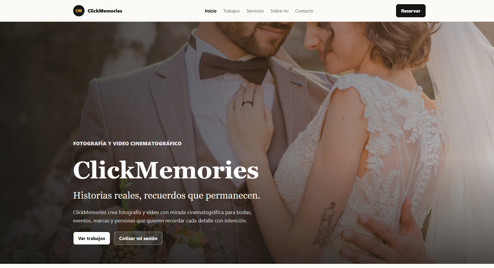
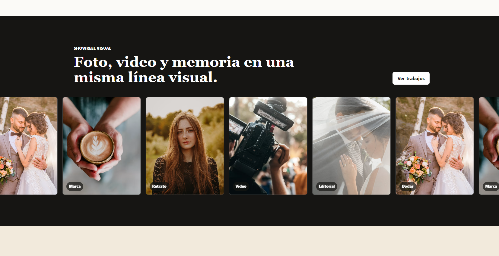
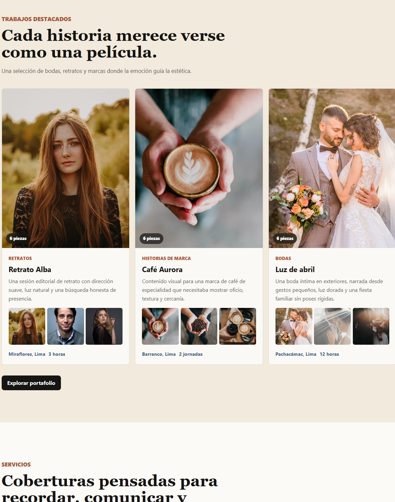
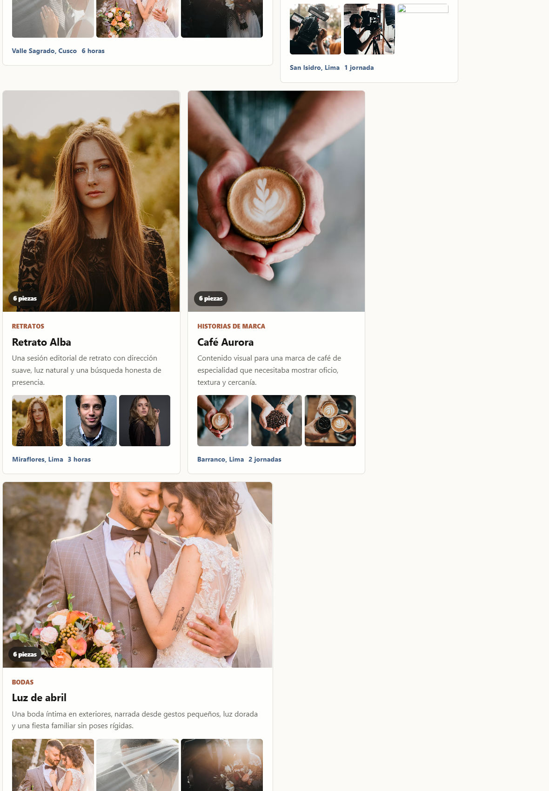
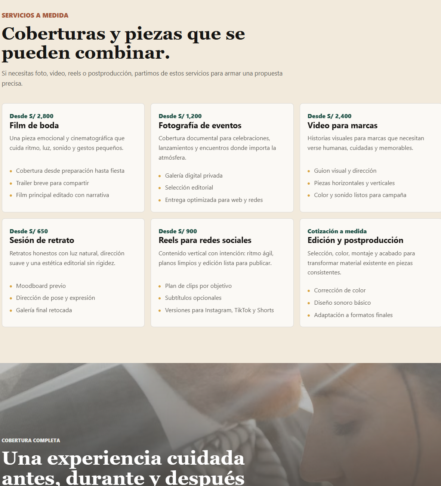
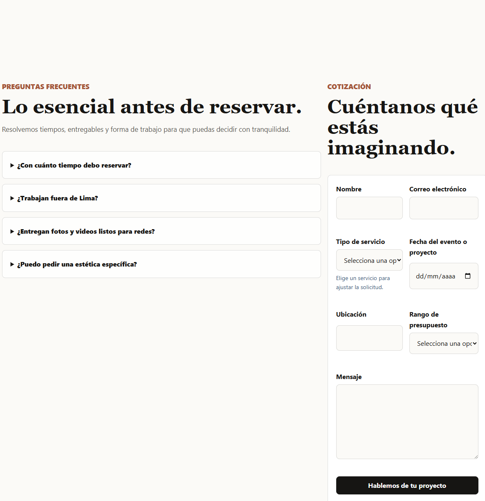

# ClickMemories

Portfolio web para un estudio de fotografía y video con mirada cinematográfica, contenido en español y una experiencia pensada para clientes que buscan bodas, eventos, retratos y piezas de marca con una estética emocional y premium.


## Demo en vivo

Demo pendiente: `https://clickmemories.example.com`

## Vista previa

<p align="center">
  
</p>

| Showreel visual | Trabajos destacados |
| --- | --- |
|  |  |

| Portafolio editorial | Servicios a medida |
| --- | --- |
|  |  |

<p align="center">
  
</p>

## Características principales

- Contenido público completamente en español.
- Página de inicio con hero visual, trabajos destacados, servicios, proceso, testimonios y CTA final.
- Comparador interactivo de dirección de color operable con puntero, táctil y teclado.
- Caso comercial con perfil profesional, proceso y canales directos del desarrollador.
- Portafolio con colección tipada de proyectos en `src/content/trabajos`.
- Portafolio editorial con proyecto destacado, filtros agrupados y composición asimétrica responsive.
- Páginas de detalle con transición visual compartida, galería, carrusel, miniaturas, lightbox accesible, teaser visual y testimonio.
- Servicios con paquetes, método de trabajo, FAQ y formulario de contacto.
- Contacto guiado con revisión y envío real por WhatsApp o correo, sin almacenar datos en el sitio.
- Política de privacidad y analítica opcional sin cookies mediante Plausible.
- Metadatos SEO, Open Graph, JSON-LD, `robots.txt` y `sitemap.xml` dinámicos.
- Biblioteca visual local en WebP para evitar dependencias de carga externas.
- Diseño responsive, accesible y enfocado en lectura visual.
- Seis pruebas end-to-end con Playwright.
- Documentación técnica y de producto en `docs/`.

## Stack tecnológico

- `Astro` para sitio estático, rutas y contenido.
- `TypeScript` para configuración y datos tipados.
- CSS propio con variables de diseño en `src/styles/global.css`.
- `Playwright` para pruebas end-to-end.
- `GitHub Actions` para validación de build y pruebas.

## Filosofía de diseño

ClickMemories debe sentirse elegante, emocional y moderno sin caer en frases genéricas. La interfaz prioriza fotografía real, espacios amplios, contraste claro y una paleta editorial con negro cálido, crema, arcilla, verde y azul sobrio.

La experiencia evita una estética de landing genérica: el primer viewport muestra marca, propuesta visual y CTAs concretos; el resto del sitio sostiene una navegación clara hacia trabajos, servicios y contacto.

## Páginas incluidas

- `/` Inicio.
- `/trabajos/` Portafolio.
- `/trabajos/[slug]/` Detalle de proyecto.
- `/servicios/` Servicios y FAQ.
- `/sobre-mi/` Filosofía y forma de trabajo.
- `/contacto/` Formulario y canales directos.
- `/quiero-una-web/` Caso comercial y perfil del desarrollador.
- `/privacidad/` Tratamiento de datos y analítica.
- `/404/` Página no encontrada.
- `/robots.txt` Directivas para buscadores.
- `/sitemap.xml` Sitemap generado.

## Arquitectura general

El proyecto separa presentación, contenido y configuración:

- `src/pages/` contiene rutas Astro.
- `src/components/` contiene piezas reutilizables.
- `src/layouts/` define el layout base con SEO, header y footer.
- `src/content/trabajos/` guarda los casos de portafolio en Markdown.
- `src/data/site.ts` centraliza navegación, servicios, FAQs, testimonios y datos de marca.
- `src/styles/global.css` define tokens visuales, layout y estados responsive.

## Estructura de carpetas

```text
.
├── docs/
├── e2e/
├── public/
├── src/
│   ├── components/
│   ├── content/
│   │   └── trabajos/
│   ├── data/
│   ├── layouts/
│   ├── pages/
│   └── styles/
├── astro.config.mjs
├── package.json
├── playwright.config.ts
└── tsconfig.json
```

## Instalación local

```bash
npm install
npm run dev
```

El sitio se abrirá por defecto en `http://localhost:4321`.

### Datos de producción

Copia `.env.example` como `.env` y reemplaza los valores provisionales antes de publicar:

```bash
PUBLIC_SITE_URL=https://tu-dominio.com
PUBLIC_CONTACT_EMAIL=hola@tu-dominio.com
PUBLIC_CONTACT_PHONE=+51 999 999 999
PUBLIC_CONTACT_WHATSAPP=51999999999

PUBLIC_DEVELOPER_NAME=Tu nombre
PUBLIC_DEVELOPER_EMAIL=tu-correo@dominio.com
PUBLIC_DEVELOPER_WHATSAPP=51999999999
PUBLIC_DEVELOPER_LOCATION=Lima, Perú
```

`PUBLIC_PLAUSIBLE_DOMAIN` es opcional. Si queda vacío, el sitio no carga analítica externa.

## Scripts disponibles

```bash
npm run dev       # Servidor local
npm run build     # Build estático
npm run preview   # Vista previa del build
npm run check     # Revisión de Astro y TypeScript
npm run readme:crops # Recorta las capturas PNG del README
npm run test      # Pruebas e2e
```

## Testing

Las pruebas en `e2e/home.spec.ts` verifican la página de inicio, el flujo real de contacto, los filtros del portafolio, el diálogo de galería, el caso comercial, la política de privacidad y las interacciones por teclado.

Para ejecutar:

```bash
npm run test:e2e
```

## SEO, accesibilidad y performance

- El layout base define título, descripción, canonical, Open Graph y `twitter:card`.
- El idioma del documento es `es`.
- Existe enlace de salto al contenido.
- Los formularios usan labels visibles y mensajes de validación en español.
- Los movimientos respetan `prefers-reduced-motion`.
- El lightbox usa un diálogo modal nativo con control de foco.
- Las imágenes de cards usan `loading="lazy"` y los assets editoriales se sirven localmente en WebP.
- El sitio está preparado para salida estática y despliegue en CDN.

## Flujo Git

Usar ramas en inglés y kebab-case:

```text
feat/homepage
feat/services-page
docs/repository-documentation
fix/responsive-polish
```

Los commits deben seguir `Conventional Commits` en inglés:

```text
feat: implement Spanish homepage
docs: add architecture documentation
test: add Playwright smoke test
```

## Despliegue

El build genera archivos estáticos en `dist/`, aptos para Vercel, Netlify, Cloudflare Pages o cualquier hosting estático.

```bash
npm run build
```

Antes de producción, configura las variables de `.env`, ejecuta las validaciones y aplica los encabezados recomendados en `docs/PRODUCTION.md`.

## Roadmap

- Reemplazar las fotografías editoriales de referencia por material propio de ClickMemories.
- Añadir integración real de video o showreel hospedado.
- Añadir más pruebas visuales y de accesibilidad.

## Licencia

Este proyecto está preparado con licencia MIT. Revisa `LICENSE` para el texto legal.

## Créditos y atribución de assets

Las fotografías editoriales de referencia provienen de Unsplash, se sirven localmente y están documentadas en `ASSETS_ATTRIBUTIONS.md`. Deben reemplazarse por material propio antes del lanzamiento final si el sitio representa un portafolio real.
